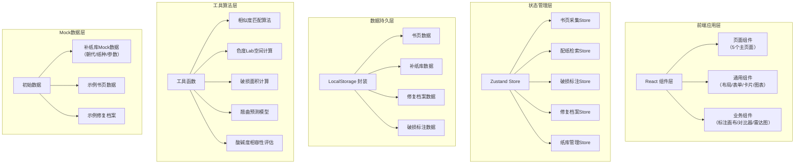
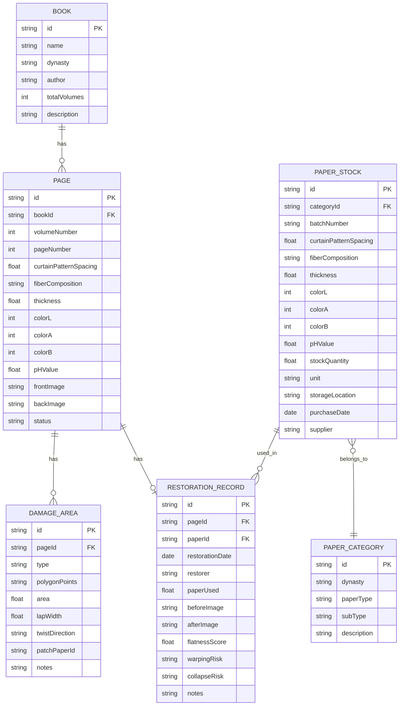

## 1. 架构设计



---

## 2. 技术描述

- **前端框架**：React@18 + TypeScript@5
- **构建工具**：Vite@5
- **状态管理**：Zustand@4
- **路由管理**：React Router DOM@6
- **样式方案**：Tailwind CSS@3 + 自定义CSS变量
- **图标库**：Lucide React
- **图表可视化**：Recharts（雷达图、热力图）
- **Canvas操作**：原生Canvas API（破损标注画布）
- **本地存储**：localStorage + 自定义序列化封装
- **离线支持**：纯前端架构，无后端依赖，所有数据本地持久化

---

## 3. 路由定义

| 路由路径 | 页面名称 | 页面组件 |
|----------|----------|----------|
| `/` | 首页/仪表盘 | Dashboard |
| `/page-collection` | 书页采集页 | PageCollection |
| `/paper-matching` | 配纸检索页 | PaperMatching |
| `/damage-annotation` | 破损标注页 | DamageAnnotation |
| `/restoration-archive` | 修复档案页 | RestorationArchive |
| `/paper-library` | 纸库管理页 | PaperLibrary |

---

## 4. 数据模型

### 4.1 ER图



### 4.2 TypeScript 类型定义

```typescript
// 古籍书目
interface Book {
  id: string;
  name: string;
  dynasty: '唐' | '宋' | '元' | '明' | '清' | '民国' | '现代' | '其他';
  author?: string;
  totalVolumes: number;
  description?: string;
  createdAt: number;
}

// 书页数据
interface BookPage {
  id: string;
  bookId: string;
  volumeNumber: number;
  pageNumber: number;
  curtainPatternSpacing: number; // 帘纹间距 mm
  fiberComposition: string; // 纤维成分
  thickness: number; // 厚度 mm
  colorL: number; // 色度 L* 0-100
  colorA: number; // 色度 a* -128-127
  colorB: number; // 色度 b* -128-127
  pHValue: number; // 酸碱度
  frontImage?: string; // 正面图 base64
  backImage?: string; // 背面图 base64
  status: 'pending' | 'annotated' | 'matched' | 'restored' | 'archived';
  createdAt: number;
}

// 破损区域
interface DamageArea {
  id: string;
  pageId: string;
  type: '虫蛀' | '霉斑' | '絮化' | '撕裂' | '缺角' | '其他';
  polygonPoints: { x: number; y: number }[];
  area: number; // 面积 mm²
  lapWidth: number; // 搭口宽度 mm
  twistDirection: '顺时针' | '逆时针' | '无';
  patchPaperId?: string;
  notes?: string;
}

// 补纸分类
interface PaperCategory {
  id: string;
  dynasty: '唐' | '宋' | '元' | '明' | '清' | '现代';
  paperType: '宣纸' | '皮纸' | '竹纸' | '棉纸' | '麻纸' | '其他';
  subType: string;
  description?: string;
}

// 补纸库存
interface PaperStock {
  id: string;
  categoryId: string;
  batchNumber: string;
  curtainPatternSpacing: number;
  fiberComposition: string;
  thickness: number;
  colorL: number;
  colorA: number;
  colorB: number;
  pHValue: number;
  stockQuantity: number;
  unit: '张' | '刀' | '卷' | 'kg';
  storageLocation: string;
  purchaseDate: string;
  supplier?: string;
  notes?: string;
}

// 匹配结果
interface MatchResult {
  paperId: string;
  overallScore: number; // 0-100
  curtainPatternScore: number;
  fiberScore: number;
  thicknessScore: number;
  colorScore: number;
  phScore: number;
}

// 修复记录
interface RestorationRecord {
  id: string;
  pageId: string;
  paperId: string;
  restorationDate: string;
  restorer: string;
  paperUsed: number;
  beforeImage?: string;
  afterImage?: string;
  flatnessScore: number; // 0-100
  warpingRisk: '低' | '中' | '高';
  collapseRisk: '低' | '中' | '高';
  notes?: string;
  createdAt: number;
}

// 应用状态
interface AppState {
  currentBookId: string | null;
  currentPageId: string | null;
  books: Book[];
  pages: BookPage[];
  damageAreas: DamageArea[];
  paperCategories: PaperCategory[];
  paperStocks: PaperStock[];
  restorationRecords: RestorationRecord[];
}
```

---

## 5. 核心算法说明

### 5.1 多维度相似度匹配算法

```
综合匹配度 = Σ(单项得分 × 权重) / Σ权重

各指标权重（可调节）：
- 帘纹间距：25%
- 纤维成分：20%
- 厚度：20%
- 色度（Lab空间）：25%
- pH值：10%

色度距离（CIE76）：
ΔE = √[(ΔL)² + (Δa)² + (Δb)²]
色度得分 = max(0, 100 - ΔE × 5)
```

### 5.2 酸碱度相容性评估

```
pH差值 = |补纸pH - 原纸pH|
相容性等级：
- 差值 ≤ 0.5：优秀（绿色）
- 0.5 < 差值 ≤ 1.0：良好（蓝色）
- 1.0 < 差值 ≤ 1.5：一般（黄色）
- 差值 > 1.5：危险（红色）
酸性预警：pH < 6.0 标记为酸性纸风险
```

### 5.3 搭口宽度计算

```
搭口宽度 = max(2mm, min(5mm, √破损面积 / 10))
默认基准：2-3mm
大破损：面积 > 1000mm²，搭口加宽至3-4mm
特大破损：面积 > 5000mm²，搭口加宽至4-5mm
```

### 5.4 翘曲风险预测模型

```
厚度差 = |补纸厚度 - 原纸厚度|
含水率差（模拟）= 基于纤维成分差异估算
翘曲风险值 = 厚度差 × 40 + 纤维差异系数 × 30 + 色度差 × 30
风险等级：
- < 30：低风险
- 30-60：中风险
- > 60：高风险
```

### 5.5 塌陷风险预警

```
厚度比 = 补纸厚度 / 原纸厚度
风险等级：
- 厚度比 ≥ 0.9：低风险
- 0.7 ≤ 厚度比 < 0.9：中风险（需加强托裱）
- 厚度比 < 0.7：高风险（建议更换补纸或双层托裱）
```

---

## 6. 项目目录结构

```
src/
├── components/          # 通用组件
│   ├── layout/         # 布局组件
│   │   ├── AppLayout.tsx
│   │   ├── Sidebar.tsx
│   │   └── Header.tsx
│   ├── ui/             # 基础UI组件
│   │   ├── Button.tsx
│   │   ├── Card.tsx
│   │   ├── Input.tsx
│   │   ├── Slider.tsx
│   │   ├── Modal.tsx
│   │   ├── Tabs.tsx
│   │   └── Badge.tsx
│   └── business/       # 业务组件
│       ├── AnnotationCanvas.tsx
│       ├── ImageComparison.tsx
│       ├── RadarChart.tsx
│       ├── MatchScoreRing.tsx
│       └── Heatmap.tsx
├── pages/              # 页面组件
│   ├── Dashboard.tsx
│   ├── PageCollection.tsx
│   ├── PaperMatching.tsx
│   ├── DamageAnnotation.tsx
│   ├── RestorationArchive.tsx
│   └── PaperLibrary.tsx
├── store/              # Zustand状态管理
│   ├── useBookStore.ts
│   ├── usePageStore.ts
│   ├── useDamageStore.ts
│   ├── usePaperStore.ts
│   └── useArchiveStore.ts
├── utils/              # 工具函数
│   ├── similarity.ts
│   ├── colorUtils.ts
│   ├── calculation.ts
│   ├── storage.ts
│   └── mockData.ts
├── types/              # TypeScript类型定义
│   └── index.ts
├── App.tsx
├── main.tsx
└── index.css           # 全局样式 + Tailwind配置
```

---

## 7. 本地存储策略

- **存储Key前缀**：`guji-restoration:${dataType}`
- **序列化**：JSON.stringify + base64编码（处理图片base64数据）
- **数据分片**：图片数据单独存储，避免单次存储过大
- **数据备份**：支持导出全部数据为JSON文件，支持导入恢复
- **存储空间**：预留5MB localStorage，超出时提示用户清理旧数据或导出

---

## 8. 离线功能保障

- 所有核心算法在前端实现，无网络依赖
- Mock数据在应用启动时自动初始化
- 支持本地数据的导入导出功能
- 图片上传转为base64本地存储
- 页面刷新后数据自动从localStorage恢复
